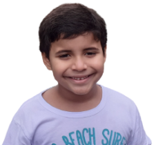

  
  <h1 align="center">Cópia do jogo Mata Mosca</h1>

<strong>Essa é uma simples cópia com os gráficos pesonalizados para o meu filho,
o mesmo possui altismo, acredito que os movimentos do jogo podem ajudar
a melhorar a atenção.</strong>

 Segue nas redes sociais.   

